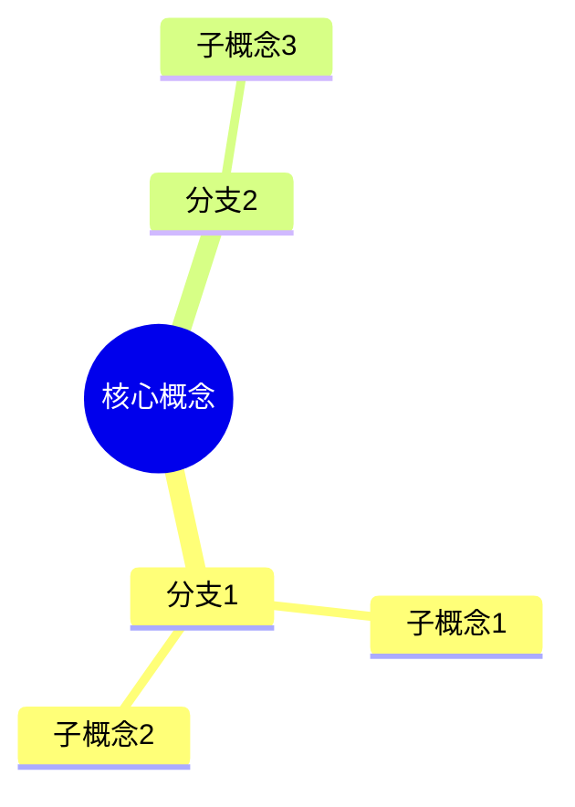

# 章节详细要求

本文档详细说明课件每个章节的输出格式和内容要求。

---

## 目录

- [1. 知识点提炼](#1-知识点提炼)
- [2. 生活场景映射](#2-生活场景映射)
- [3. 知识点脑图](#3-知识点脑图)
- [4. 趣味自测](#4-趣味自测)
- [5. 易考点](#5-易考点)
- [6. 易错点（思维陷阱）](#6-易错点思维陷阱)
- [7. 难点](#7-难点)
- [8. 习题](#8-习题)
- [9. 历年中考真题](#9-历年中考真题)

---

## 1. 知识点提炼

**教学方法**：认知负荷理论

**内容要求**：
- 使用简洁的bullet points
- 信息chunking，避免过长段落
- 清晰的层级结构（使用##、###）
- 使用表格对比概念
- 公式使用LaTeX格式（如：$G = mg$）
- 重要概念用**粗体**标注

**输出格式**：
```markdown
## 1. 知识点提炼

### 1.1 核心概念
- **概念1**：定义
- **概念2**：定义

### 1.2 公式和计算
**计算公式**：
$$G = mg$$

**符号说明**：
- $G$：重力（单位：N）
- $m$：质量（单位：kg）
- $g$：重力加速度（单位：N/kg）

### 1.3 对比表格
| 项目 | 内容1 | 内容2 |
|------|--------|--------|
```

---

## 2. 生活场景映射

**教学方法**：现象导向学习

**内容要求**：
- 提供3-5个真实生活场景
- 每个场景包含：
  - 📍 场景描述（使用emoji增加趣味性）
  - 现象分析（物理原理）
  - 思考问题（引发思考）
- 场景应科学合理、贴近学生生活
- 体现"从生活走向物理"的理念

**输出格式**：
```markdown
## 2. 生活场景映射

### 场景1：场景名称
📍 emoji **简短标题**

- **现象**：具体描述
- **原因**：物理原理
- **应用**：实际应用

**思考**：为什么...？
✓ 答案：因为...
```

---

## 3. 知识点脑图

**教学方法**：概念地图

**内容要求**：
- 使用Mermaid语法
- 优先使用`mindmap`图
- 复杂流程可使用`flowchart`
- 节点使用中文
- 层级清晰，关系明确

**输出格式**：
```markdown
## 3. 知识点脑图


```

---

## 4. 趣味自测

**教学方法**：同伴教学

**内容要求**：
- 提供5个互动式Q&A问题
- 使用可折叠区块（`<details>`标签）
- 每个问题包含：
  - 问题陈述
  - 选项（A/B/C/D）
  - 答案（点击查看）
  - 详细解析
  - 记忆技巧（💡）
- 难度递进：简单→中等→难

**输出格式**：
```markdown
## 4. 趣味自测

### 🎯 自测题1：标题

**Q**: 问题内容

A. 选项A
B. 选项B
C. 选项C
D. 选项D

**点击查看答案**
<details>
<summary>答案：B</summary>

**解析**：
- 解析要点1
- 解析要点2

💡 **记忆技巧**：记忆口诀或技巧
</details>
```

---

## 5. 易考点

**教学方法**：学习迁移

**内容要求**：
- 列出5-8个高频考点
- 每个考点包含：
  - 核心考点
  - 典型题模式
  - 考查方式
- 结合中考命题趋势
- 标注重要程度（⭐⭐⭐☆☆）

**输出格式**：
```markdown
## 5. 易考点

### 考点1：考点名称
**重要程度**：⭐⭐⭐☆☆

**核心考点**：
- 要点1
- 要点2

**典型题模式**：
> 题目示例

**考查方式**：
- 选择题：...
- 填空题：...
```

---

## 6. 易错点（思维陷阱）

**教学方法**：认知冲突

**内容要求**：
- 列出3-5个常见错误
- 每个易错点包含：
  - ⚠️ 典型错误
  - 为什么错
  - 正确理解
  - 对比分析
- 使用对比表格或示例
- 强调"为什么错"而不仅仅是"什么是错"

**输出格式**：
```markdown
## 6. 易错点（思维陷阱）

### ⚠️ 易错点1：标题

**典型错误**：
> "错误说法"

**为什么错**：
- 原因分析

**正确理解**：
```
✓ 正确：...
✗ 错误：...
```
```

---

## 7. 难点

**教学方法**：建模教学

**内容要求**：
- 列出2-4个难点
- 每个难点标注难度（⭐⭐⭐☆☆）
- 包含：
  - 难点解析
  - 理解步骤（分步骤讲解）
  - 实例分析
  - 记忆口诀
- 步骤清晰，逻辑严密

**输出格式**：
```markdown
## 7. 难点

### 🔥 难点1：标题
**难度**：⭐⭐⭐☆☆

**难点解析**：

#### 理解步骤

**第1步**：...
**第2步**：...

#### 实例分析

**例**：...
```

---

## 8. 习题

**教学方法**：认知负荷

**内容要求**：
- 总题量：15-30题
- 难度分布：
  - 简单题：5-10题
  - 中等题：5-10题
  - 难题：5-10题
- 题型不限：选择、填空、计算、简答、作图等
- 每题必须包含：
  - 题目难度标注（【简单】/【中等】/【难】）
  - 题目内容
  - 答案
  - 完整解析
    - 考查知识点
    - 解题思路
    - 易错提示
    - 扩展思考（可选）

**习题解析模板**：
```markdown
#### 【难度】习题编号

题目内容

**答案:** [正确答案]

**解析:**
- **考查知识点**: [相关知识点]
- **解题思路**: [简要步骤]
- **易错提示**: [常见错误]
- **扩展思考**: [可选的深度内容]
```

---

## 9. 历年中考真题

**教学方法**：学习迁移

**内容要求**：
- 题量：10-15题（严格限制）
- 时间范围：过去10年（2015-2024）
- 必须包含：
  - 年份
  - 城市
  - 题目内容
  - 答案
  - 完整解析
    - 考查知识点
    - 难度
    - 数据来源（训练数据/网络）
    - 置信度（高/中/低）
    - 解题思路

**中考真题格式模板**：
```markdown
### 【年份】城市中考真题

题目内容

**答案:** [正确答案]

**解析:**
- **考查知识点**: [相关知识点]
- **难度**: [简单/中等/难]
- **数据来源**: [训练数据/网络]（置信度: [高/中/低]）
- **解题思路**: [详细步骤]
```

**数据来源声明**：
- 所有真题必须标注：**数据来源**: 训练数据（置信度: 高/中/低）
- 只能从LLM训练数据中选取，不能自由发挥
- 如果数据来源不确定，标注（置信度: 中）或（置信度: 低）

---

## 使用说明

本文档是 `SKILL2.md` 的补充参考，详细说明了每个章节的具体输出格式和内容要求。

**使用方法**：
1. 查阅本文档了解具体章节的格式要求
2. 按照模板格式生成课件内容
3. 确保所有必需元素都包含
4. 参考质量检查清单进行验证

---

*最后更新: 2026-02-13*
