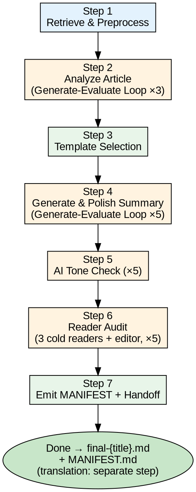
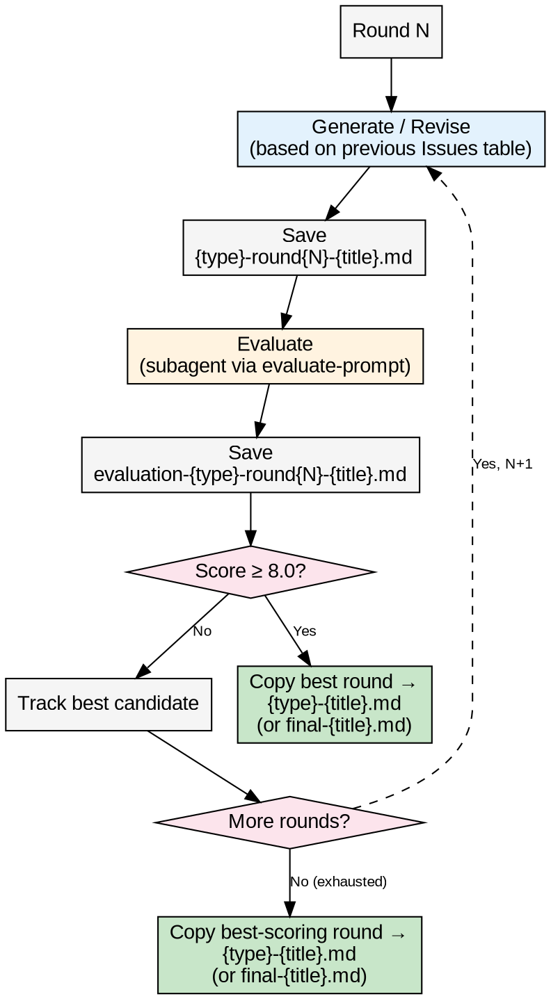

# yiyue31-summary

Intelligent article summary generator supporting multiple templates.

## Core Features

- **Multiple Templates** - Tech Article / Paper / Concise Notes (default)
- **Intelligent Analysis** - Auto-detect article type, topic, terminology, highlights
- **Quality Assurance** - Generate-Evaluate loops with scored evaluation, an AI-tone check, and a cold-reader audit gate
- **Multiple Inputs** - URL, file path, direct paste

## Quick Start

```bash
# Summarize a URL
Summarize https://example.com/react-hooks

# Summarize a file
Summarize ./articles/python-async.md

# English output
Summarize https://example.com/react-hooks
```

## Templates

| Template         | Use Case                         |
|------------------|----------------------------------|
| **Tech Article** | Tech blogs, announcements        |
| **Paper**        | Academic papers, research reports|
| **Concise Notes**| Quick learning, review           |

## Workflow



### Generate-Evaluate Loop Detail

The scored loops (Step 2 analysis, Step 4 summary) follow the same pattern:



> Steps 5 and 6 use a lighter detect-and-fix pattern — each round checks, applies all fixes, and repeats until the report(s) come back clean (max 5 rounds). No score threshold. Step 5 (AI tone) runs one check; Step 6 (reader audit) runs 3 parallel cold readers per round and a full-context editor applies the fixes.

### Loop Parameters per Step

| Step | Type | Max Rounds | Timeout | Output |
| ----- | ----- | ---------- | ------- | ------ |
| Step 2 | Analysis | 3 | — | `analysis-{title}.md` |
| Step 4 | Summary | 5 | 30 min | `summary-{title}.md` |
| Step 5 | AI Tone | 5 | — | `tone-polished-{title}.md` |
| Step 6 | Reader Audit | 5 | — | `final-{title}.md` |

Steps 3 (template selection) and 7 (manifest + handoff) are not loops. Chinese translation is a **separate `yiyue31-translator` invocation** after summary completes — it is no longer a summary step (see Step 7).

## Output Files

```text
{title}/summary/
  ├── original-{title}.md                       # Original article (Step 1)
  ├── analysis-round{N}-{title}.md              # Analysis drafts (Step 2)
  ├── evaluation-analysis-round{N}-{title}.md   # Analysis eval reports (Step 2)
  ├── analysis-{title}.md                       # Best analysis (Step 2 output)
  ├── summary-round{N}-{title}.md               # Summary drafts (Step 4)
  ├── evaluation-round{N}-{title}.md            # Summary eval reports (Step 4)
  ├── summary-{title}.md                        # Best summary (Step 4 output)
  ├── evaluation-ai-tone-round{N}-{title}.md    # AI tone reports (Step 5)
  ├── tone-polished-{title}.md                  # Tone-polished summary (Step 5 output)
  ├── evaluation-reader-audit-round{N}-{profile}-{title}.md # Cold-reader reports (Step 6)
  ├── final-{title}.md                          # Final summary (Step 6 output)
  └── MANIFEST.md                               # Output inventory + translation handoff (Step 7)
```

> Chinese translation (when run) lives in the translator's own directory: `{title}/translation/translated-{title}-zh.md`. It is produced by a separate `yiyue31-translator` invocation reading `MANIFEST.md` and `references/translation-contract.md` — not by summary.

---

**Detailed Workflow**: [SKILL.md](./SKILL.md)
